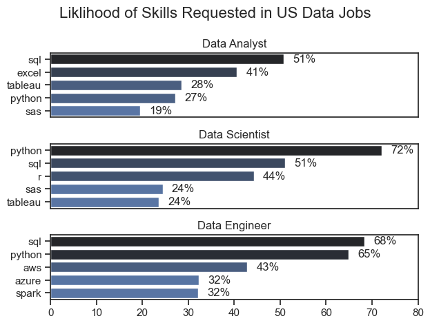

# The Analysis

## What are the most in demand skills for the top 3 most data roles?

To find the most demanded skills for the top 3 most popular data roles. I filtered out those positions by which ones were the most popular, and got the top 5 skills for these top 3 roles. This query highlights the most popular job titles and their top skills, showing which skills I should pay attention to depending on the role I'm targeting.

View my notebook with detailed steps here: [1_Skill_Demand.ipynb](Project_Section/1_skill_count.ipynb)

### Visualize data

```python
fig, ax = plt.subplots(len(job_titles), 1)

sns.set_theme(style="ticks")

for i, job in enumerate(job_titles):
    df_plot = df_megrged[df_megrged["job_title_short"] == job].head(5)

    sns.barplot(data = df_plot, x="skill_percent", y="job_skills", ax=ax[i], hue="skill_percent", palette="dark:b_r")

    ax[i].set_title(job)
    ax[i].set_ylabel("")
    ax[i].set_xlabel("")
    ax[i].legend().remove()
    ax[i].set_xlim(0, 80)
    for n,v in enumerate(df_plot["skill_percent"]):
        ax[i].text(v + 2, n, f'{v:.0f}%', va='center')

    if i != len(job_titles) - 1:
        ax[i].set_xticks([])


fig.suptitle("Liklihood of Skills Requested in US Data Jobs", fontsize=16)
plt.tight_layout()
plt.show()
```

### Results



### Insights

- SQL is the most requested skill for Data Analysts and Data Scientists, with it in over half the job postings for both roles. For Data Engineers, Python is the most sought-after skill, appearing in 68% of job postings.
- Data Engineers require more specialized technical skills (AWS, Azure, Spark) compared to Data Analysts and Data Scientists who are expected to be proficient in more general data management and analysis tools (Excel, Tableau).
- Python is a versatile skill, highly demanded across all three roles, but most prominently for Data Scientists (72%) and Data Engineers (65%).
